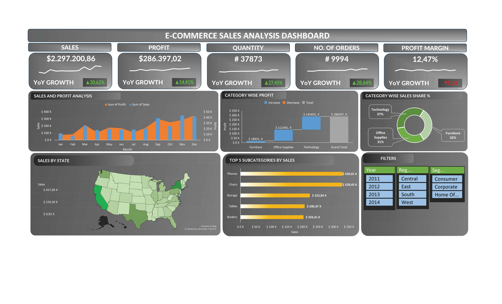

# Project Title: E-Commerce Sales Analysis

## 📌 Deskripsi Singkat
Analisis ini bertujuan untuk performa e-commerce, mengidentifikasi peluang pertumbuhan, serta menemukan area yang perlu dioptimalkan agar bisnis dapat berjalan dapat tumbuh secara berkelanjutan dan menguntungkan.

## 🧰 Tools / Teknologi
- Excel

## 📂 Struktur Folder
- File Dataset
- Dashboard

## 📊 Insight Utama
- Volumen penjualan dan jumlah order meningkat secara signifikan, namun margin keuntungan menurun. Ini menandakan pertumbuhan lebih didorong oleh volume daripada efisiensi profit.
- Terdapat pola musiman (seasonality), kemungkinan dipengaruhi oleh promo akhir tahun atau peningkatan demand pada Q4.
- Meskipun Furniture memiliki penjualan, kontribusi profitnya rendah. Ini menunjukan adanya indikasi margin kecil atau biaya tinggi.
- Sales relatif merata, namun profit tidak merata. Menunjukan bahwa tidak semua penjualan menghasilkan keuntungan yang sebanding.
- Produk teknologi (Phones) menjadi driver utama revenue, sementara Furniture tetap kuat dari sisi volume.
- Potensi <b>regional strategy</b> : fokus promosi di state dengan performa tinggi dan optimasi distribusi di state dengan performa rendah.

## 🔧 Cara Analisis Dilakukan
1. Menghapus duplikasi data.
2. Data Cleaning
   Tidak dilakukan karena dataset yang diperoleh sudah rapi (clean) dan tidak perlu melakukan cleaning dan transform.
3. Exploratory Data Analysis (Pivot Table)
   - Analisis kinerja penjualan secara Year-Over-Year.
   - Analisis tren penjualan bulanan.
   - Analisis kontributor profit terbesar dari beberapa kategori.
   - Analisis distribusi penjualan antar kategori.
   - Analisis top 5 sub-kategori terlaris.
   - Analisis penjualan terkonsentrasi di beberapa state.
4. Visualisasi (dashboard)
   - 
5. Kesimpulan
   Perusahaan menunjukan pertumbuhan penjualan yang kuat, namun perlu fokus pada peningkatan profit margin melalui optimasi kategori, subkategori, dan strategi harga.

## 📁 Dataset
  - Sumber dataset: Kaggle
  - Jumlah baris: ± 9000
  - Jumlah kolom: 22

## 🧠 Kesimpulan
  - Bisnis e-commerce mengalami pertumbuhan yang sehat dari sisi penjualan dan jumlah order.
  - Pertumbuhan saat ini bersifat <b>volume driven</b>, bukan <b>margin driven</b>, terlihat dari penurunan margin YoY.
  - Kategori <b>Technology</b> adalah pilar utama profit, sementara <b>furniture</b> perlu evaluasi strategi harga dan biaya.
  - Pola musim kuat di Q4, sehingga periode ini sangat krusial untuk promosi dan stok.
  - Optimalisasi margin dan efisiensi biaya menjadi prioritas berikutnya untuk menjada profitabilitas jangka panjang.

## 💡 Rekomendasi Bisnis
- Fokuskan investasi pada kategori dengan profit tinggi (Technology).
- Optimalkan profit margin pada kategori Furniture.
- Perbaiki strategi harga dan diskon.
- Maksimalkan momentum musiman (Q4 Focus Strategy).
- Kembangkan strategi berdasarkan Subkategori terlaris.
- Terapkan strategi regional yang lebih terarah.
- Tingkatkan profit per order (bukan hanya jumlah order).
